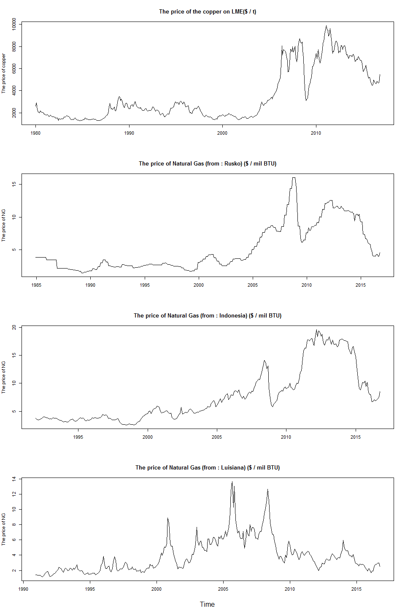
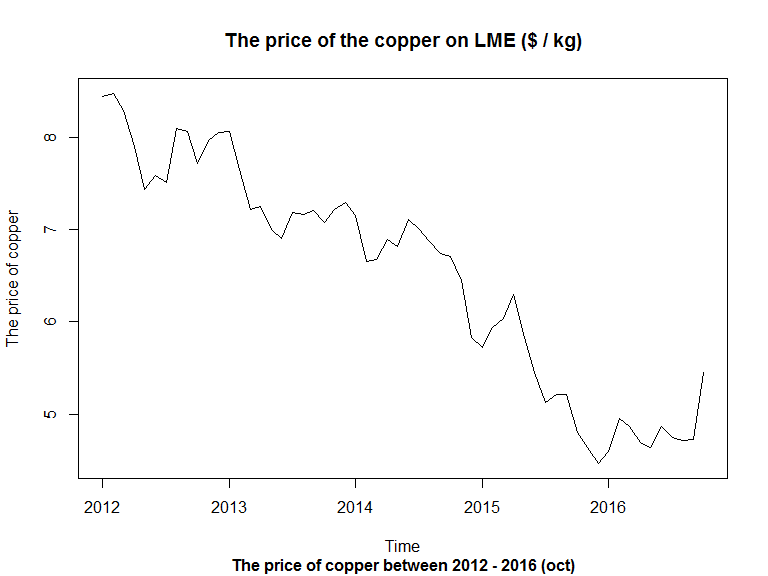
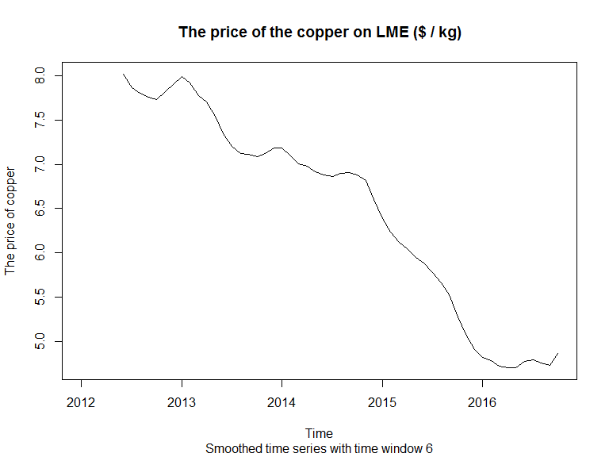
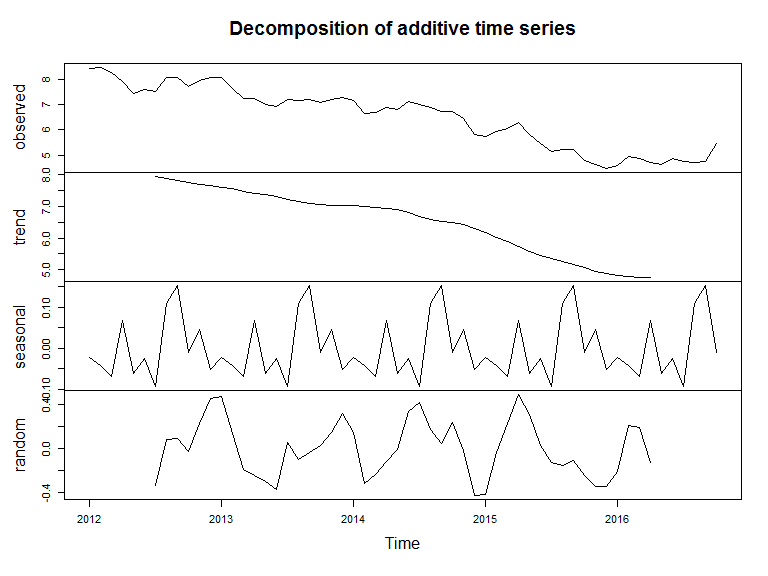
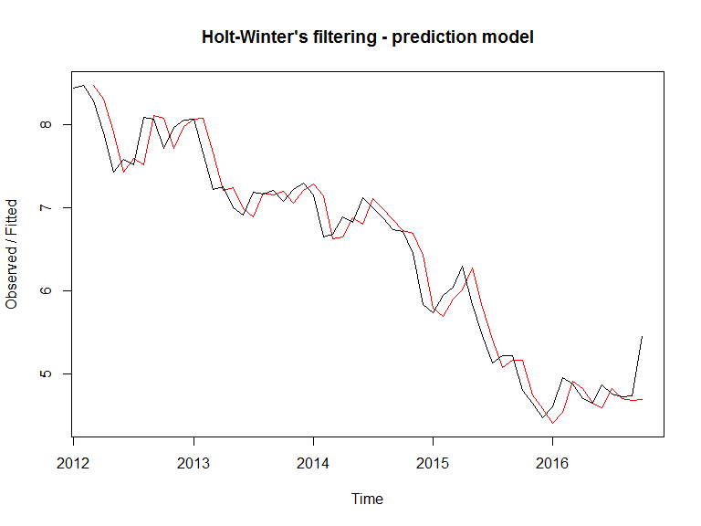
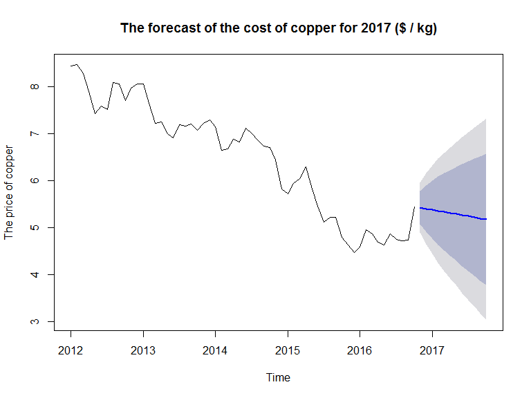
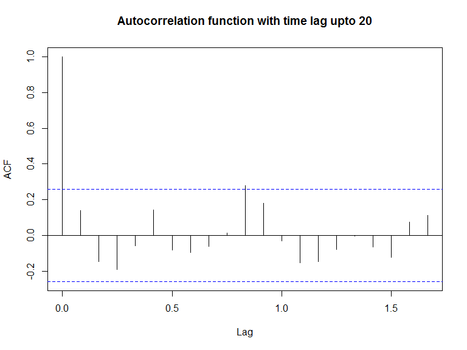
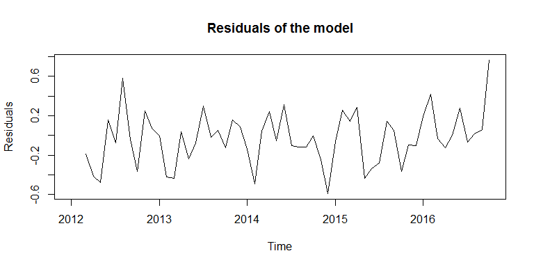
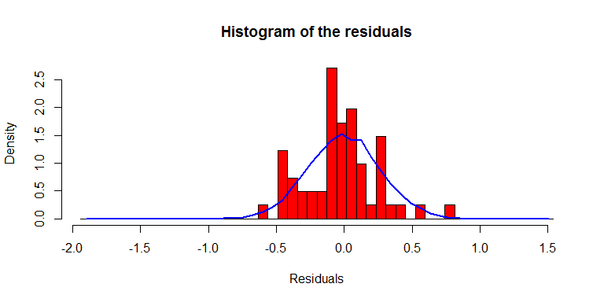

# The Analysis of the Development of Copper's Price on the Global Market (challenge test)
Anton Kovac  
`r format(Sys.time(), "%d %B, %Y")`  


## Introduction 

The goal of this work is to analyze the price of the copper of natural gas on the global markets from 2012 until now. Further, I present the model of forecasting the prices for the next year. The work is the part of the project under [challengest][1] and the [protherm][2] company. 

The data was downloaded from following source:

__www.imf.org/external/np/res/commod/External_Data.xls__. 

### The characteristic of the data 

The raw data contained the price of several comodities from 1980 until now, october 2016 respectively. The data was observed monthly (12 values per year). After cleaning the data and differentiating the appropriate features I obtained following information:

* the price of copper on LME ([London Metal Exchange][3]) in _USD / t_ units
* the price of natural gas from [^1]:
    - Russia
    - Indonesia 
    - Luisiana

After missing values filtering I obtained the price of the comodities from 1992. Following graph illustrate the development of the comodities' price. 

<!-- -->


According to the assignment I decided to analyze the price of the copper from 2012 until october 2016 (the last observed value). Furthemore, I present the forecast of the price for 2017.  

### The analysis of the copper's price 2012 until october 2016

I converted the data from "USD / t" units to "USD / kg". Following plot represents the price development of copper from 2012. 

<!-- -->

We can see obvious trend with slightly fluctuations. The significant decreases of the price come in the begining of the current year. In 2014 after slightly increase of the price comes rapid fall of the price. In 2016 are the prices approximatly stable. 

We can consider a seasonal component regarding the repeatition of the procesess of decline. I assume that this time series can be described as additive model.

I present some descriptive characteristics of the data. 


     Min       Max    Median       Mean   Variance    Std.Dev
--------  --------  --------  ---------  ---------  ---------
 4.47179   8.47078   6.84668   6.494203   1.470876   1.212797

##### The Smoothing of the time series

I used the Simple Moving Average with time window of 6 for the identification of the trend. The averaged values are on the 6-month scale, a half-year respectively (every smoothed value of the time series represents the average in previous 6-months). 

<!-- -->

The time series smoothed from random component shows decresing trend in copper price from 2013 (the first 3-months period) until 2016. In the last period of the years 2014 and 2015 was the price stabilized with following decrease. In the last period of 2013 we can see rapid increase in the price of copper. 

##### The time series decomposition

The time series decomposition allows us to look at the separate components of the time series, i.e trend, seasonal and random component. Following plot shows our time series decomposition.

<!-- -->

There is obvious trend in decreasing the price of copper. The seasonal component shows increase of the price in the last period of the current year. 

By the seasonal component examination I further judge by visual inspection the changes of the time series before and after elimination of the seasonal component. Further, I used the power spectra analysis (after the elimination of the trend). I came to the conclusion that the time series can be described by additive model with increasing and decreasing trend without the seasonal component. 

### The model 

To model of the time series I used the Holt's model of exponential smoothing. It is controled by two parameters:

* $\alpha$ - for the estimate of the level of the current time point
* $\beta$ - for the estimate of the slope of the trend component at the current time point

<!-- -->

The plot represents fitting of the model. The red line represents the fitted values. The black line shows the observed values. The model estimate the development of the price of copper quite well with minor time advance. The sum of squared erros of the model is 4.0714386

#### The prediction of the development of the price of copper for 2017

The following plot shows the prediction of the development of the copper's price for 2017. The blue line represents the estimate, gray (dark) area is the 80% confidence interval, and braun (brighter) represents 95% confidence interval. 

<!-- -->

#### The control of the model's assumptions 

I used standard control of the residuals for the check wheter the predictive model could be improved. 

Firstly, I checked the correlation of the residuals with time lag. The good model should demonstrate the zero correlation of the residuals with consider the their time lagged values (the residuals in time $t$ should demonstrate zero-correlation with the residuals in time $t - l$ where $l$ is the time lag constant).

<!-- -->

The correlogram shows the exceeding the significant bounds in the sample at time lag 8. However, we would expect one in 20 autocorrelations for the first 20 lags exceed the significant bounds by chance alone (in terms of the type I. error)[^2]  

I further carried out the Ljung-Box test. The value of $p > 0,05$ indicate little evidence of non-zero correlations in sample prediction errors at lags 1-20. 


```
## 
## 	Box-Ljung test
## 
## data:  copper_forecast$residuals
## X-squared = 22.425, df = 20, p-value = 0.3179
```

Lastly, I checked the assumption of constant variance of residuals over time and their normal distribution around the 0 mean and their standard deviation. 

<!-- -->

The plot shows approximatelly constant variance over time.

<!-- -->

The histogram of the residuals shows slightly leptokurtic characteristics. However it approximately follows the normal distribution function. 

After all we can summarisze that our model estimates the current data well.  

## Conclusion

I summarized in this work the development of the copper's price from 2012 until october 2016. Further, I presented the prediction of the price of copper for 2017. In summary, the price of copper shows continual decrease from 2012 while in 2016 was the price stabilized. My model estimates further decline in the price in 2017. It is important to note that the current model may not be the right one. I do not rule that the different model can describe the data even better. 

#### Reference

1. Coghlan, A. (2014). A Little Book of R For Time Series. Release 0.2. online <https://media.readthedocs.org/pdf/a-little-book-of-r-for-time-series/latest/a-little-book-of-r-for-time-series.pdf> (cited 23.12.2016)

2. Brockwell, P. J., & Davis, R. A. (2013). Time series: theory and methods. Springer Science & Business Media.


##### Technical details

This document was created as Rmarkdown file in RStudio. The whole code (including the source code) will be published in my [github account](https://github.com/Tonda-K/Projects). 

[1]: https://www.challengest.com/challenges
[2]: https://www.protherm.sk/pre-nasich-zakaznikov/vyrobny-zavod/o-spolocnosti/index.sk_sk.html
[3]: https://www.lme.com/
[4]: https://en.wikipedia.org/wiki/British_thermal_unit


[^1]: in units _USD per 1 milion British Thermal Unit ([BTU][4])
[^2]: Note: Autocorrelation function with $l = 1$ gives 1
